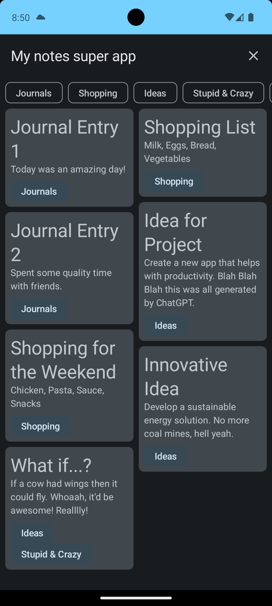

![App logo][app-logo]

# Notes

> A note-taking Android app, built with Jetpack Compose.

[Project landing page](https://otwartaturystyka.pl)

_Started on Friday, 21th October 2016 (Android version)_

_Started on Monday, 12th August 2019 (Flutter version)_

# Overview

Notes is simple app for note-taking and remembering things

**Features**

- create account and sign in
- create, update, and delete textual notes
- add categories to notes to aid in management
- set reminder for a specific note

Planned features:

- receiving rewards for visited places

### Run the backend

See the [backend README] to learn how to run the backend server that this app
requires to operate.

[app-logo]: app/src/main/res/mipmap-xxxhdpi/ic_launcher.png
[backend README]: ../backend/README.md
